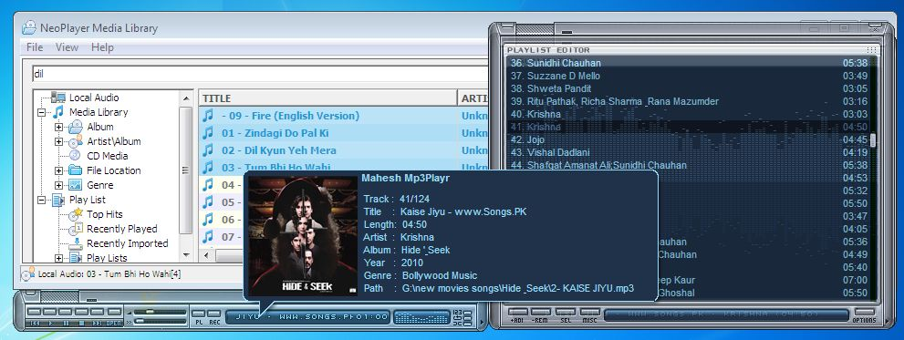



## NEO MP3 player 2\.1: Most amazing Submission\(Update 1\)

### Description

NeoPlayer: Perhaps the best Submission on PSC so far.

Update: code is properly aligned, skin fixes, performance tweaks, more comments are added and many more..

Please comment about its performance bugs and suggestions, help keeping VB alive.

Description:

It handles the playing chores for MP3,Ogg, WAV, MIDI, CD Audio, It looks and sounds great, it's lightweight and powerful, and it manages your media in hard drive in a fantastic way by its easy to use media library. It has all features that a professional mediaplayer like winamp (Skin, equalizer, DFX, Library, Visualisation, Tag editing etc.) should have.

I am sharing my mp3Player Project with all u great developers. I am working on

it since last 3-4 years(as my hobby). I have learnt a lot from PSC and I hope this project will be helping many. Atleast it will show the strength of VB.

I am waiting for all suggestions and bugs found so that i can make it better one.

Use the link below to download fully working project with all compatibility files available

(incase PSC deletes some)

Source code: [url="http://www.mediafire.com/?8tx8bixgg6pw6y6"]

For more info visit "http://neoaudioplayer.blogspot.com/2011/02/neo-mp3-player-v20-setup.html"
 
### More Info
 

             |
---                |---
**Submitted On**   |2011-03-05 19:17:48
**By**             |[mahesh Kurmi](https://github.com/Planet-Source-Code/PSCIndex/blob/master/ByAuthor/mahesh-kurmi.md)
**Level**          |Advanced
**User Rating**    |4.8 (38 globes from 8 users)
**Compatibility**  |VB 6\.0, VBA MS Access
**Category**       |[Complete Applications](https://github.com/Planet-Source-Code/PSCIndex/blob/master/ByCategory/complete-applications__1-27.md)
**World**          |[Visual Basic](https://github.com/Planet-Source-Code/PSCIndex/blob/master/ByWorld/visual-basic.md)
**Archive File**   |[NEO\_MP3\_pl219915352011\.zip](https://github.com/Planet-Source-Code/mahesh-kurmi-neo-mp3-player-2-1-most-amazing-submission-update-1__1-73770/archive/master.zip)

